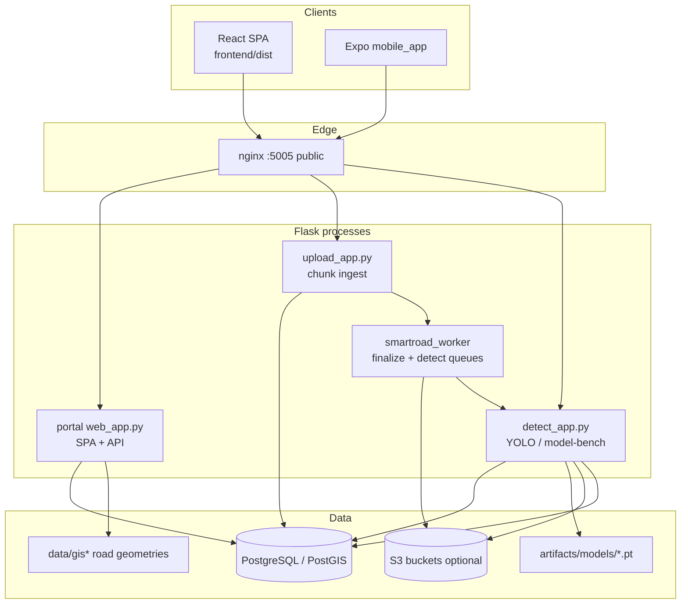
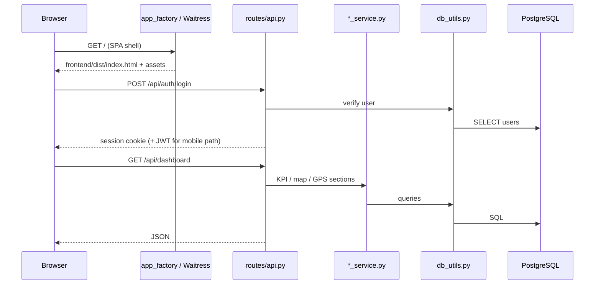
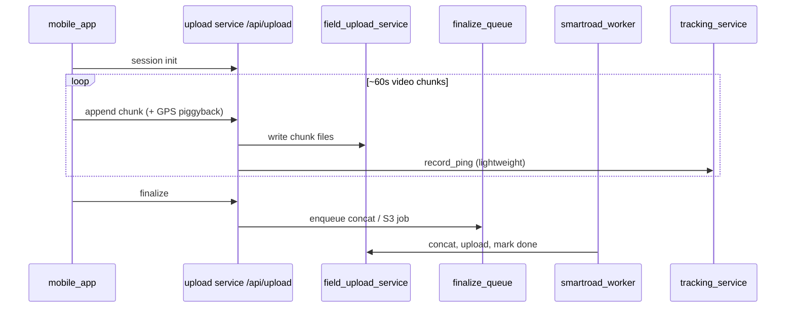
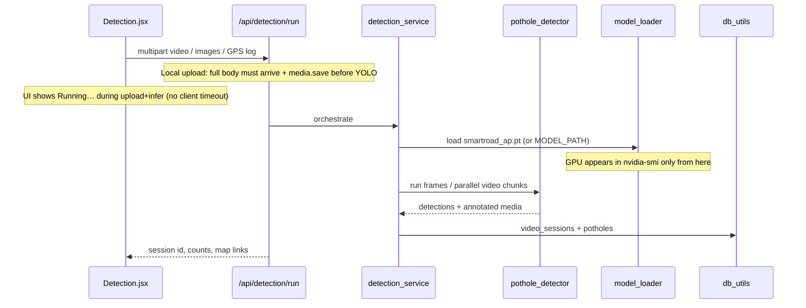

# SmartRoad AP

Road-maintenance operations platform for Andhra Pradesh (and Telangana field coverage): AI pothole detection (YOLOv12), vendor / work-order workflows, field survey + GPS tracking, and GIS road-network maps.

Clients talk to a Flask JSON API. The React portal is served from the same process (or via nginx in multi-service deploy). Field crews use the Expo app (`mobile_app/`) against the same API.

---

## Table of contents

1. [What the system does](#1-what-the-system-does)
2. [High-level architecture](#2-high-level-architecture)
3. [Repository structure](#3-repository-structure)
4. [How requests flow](#4-how-requests-flow)
5. [How modules interact](#5-how-modules-interact)
6. [Major features end-to-end](#6-major-features-end-to-end)
7. [Roles and access](#7-roles-and-access)
8. [Data model](#8-data-model)
9. [Running locally](#9-running-locally)
10. [Production / multi-service](#10-production--multi-service)
11. [Further docs](#11-further-docs)

---

## 1. What the system does

| Area | Purpose |
|------|---------|
| **Detection** | Local or S3 media (+ GPS log) → YOLO inference → annotated output + `potholes` rows; DOCX reports from sessions |
| **Operations** | Create work orders from sessions → allocate to vendors → status machine → completion validation |
| **Survey** | Daily km targets, road-segment coverage (NH/SH/MDR/local), place geocode + district locate on GIS |
| **Tracking** | Live / historical GPS trails for videographers while capturing |
| **Field upload** | Chunked ~60s video uploads from phone → finalize → S3/local → **auto-detect queue** (sequential YOLO) |
| **Admin (field)** | Field KPIs: videos, members, km by class, potholes (today/yesterday drill-downs) |
| **Model bench** | Compare alternate weights under `tools/ml/models/` without touching production weights |

---

## 2. High-level architecture



**Monolith mode (dev / simple deploy):** one process (`python web_app.py`) serves API + SPA on a single port. Upload and detection run in-process.

**Supabase free tier (current remote DB):** use **only** the monolith — `python web_app.py`. Do **not** start portal + upload + detect as separate processes with large pools (`DB_POOL_MAX` / `DB_POOL_HARD_CAP` ≤ 4; `WAITRESS_THREADS` ≤ 4). Multi-process split will exhaust the pooler connection budget. Prefer session pooler + `DB_SSLMODE=require`. Keep GIS on disk (`data/gis_states/` via `tools/gis/*`) — do **not** run `scripts/seed_roads_registry.py` against free tier. Demo app logins: [`credentials.json`](credentials.json).

**Split mode (AceCloud / self-hosted Postgres):** nginx routes `/api/upload*` → upload service, `/api/detection*` and `/api/model-bench*` → detect service, everything else → portal. A finalize worker drains the chunk-concat / S3 queue. See [docs/ops/MULTI_SERVICE.md](docs/ops/MULTI_SERVICE.md).

---

## 3. Repository structure

```
smart_road_app/
├── web_app.py              # Portal entry (imports smartroad_path → backend/)
├── upload_app.py           # Upload-only entry
├── detect_app.py           # Detection-only entry
├── db_utils.py             # Shim → backend/db/
├── smartroad_path.py       # Puts repo root + backend/ on sys.path
├── download_data.py        # Shim → tools/ml/download_data.py
├── model_testing/          # Import shim → tools/ml/ (legacy module name)
├── requirements.txt
├── .env.example            # Env template (copy → .env)
│
├── backend/                # Python server (Flask API, detection, DB)
│   ├── routes/             # app_factory, /api/*, domain services
│   ├── db/                 # Postgres access + schema init
│   ├── detector/           # YOLO image/video pipeline
│   ├── schema.sql
│   ├── model_loader.py
│   ├── pothole_detector.py
│   └── …
│
├── tools/
│   ├── gis/                # OSM download / clip (→ data/gis_states/)
│   └── ml/                 # Training, Roboflow, model-bench weights
│
├── frontend/               # React + Vite SPA
├── mobile_app/             # Expo field-capture app
├── reporter_app/           # Citizen complaint app
│
├── artifacts/              # Gitignored models (see artifacts/README.md)
├── data/                   # Runtime + GIS (mostly gitignored; data/ref/ tracked)
├── docs/                   # Ops notes (incl. docs/drgp/)
├── migrations/
├── scripts/                # services.sh, clean_downloaded_data.py, bootstrap
├── branding/
└── tests/
```

Root keeps thin **entry shims**; application code lives under `backend/`. Regenerate GIS, datasets, and weights via `tools/gis/*`, `tools/ml/*`, and `artifacts/models/` — see [docs/ops/PROJECT_SETUP.md](docs/ops/PROJECT_SETUP.md).

---

## 4. How requests flow

### Web portal (browser)



1. Non-`/api` paths → SPA (`index.html`); React Router handles the rest client-side.
2. `/api/*` → `routes.api.api_bp`.
3. Handlers call service modules; **only `db_utils` touches Postgres**.
4. Auth: Flask-Login cookie on web; Bearer JWT on mobile (`token_auth`). Idle web sessions enforced by `session_guard`.

### Field phone upload



Live tracking is intentionally light: each chunk upload can carry the current fix; a separate `/api/tracking/ping` is only an infrequent keepalive (high-frequency ping loops previously exhausted sockets).

### Detection (YOLO)



**Local Detection upload vs S3:** choosing a file in the browser posts the **entire video + GPS JSON** in one `POST /api/detection/run`. Flask does not start `pothole_detector` / `load_model()` until that multipart body is fully received and written to a temp file — so a long quiet stretch before `htop` / `nvidia-smi` show YOLO is usually **network upload + disk save**, not inference. Prefer **S3-selected** media (or field chunk upload + later detect) when files are large; the phone path already streams ~60s chunks.

---

## 5. How modules interact

### Backend layering

| Layer | Files | Responsibility |
|-------|--------|----------------|
| Entry | `web_app.py`, `upload_app.py`, `detect_app.py` | Set `SMARTROAD_SERVICE`, call `run_service` / `create_app` |
| App shell | `routes/app_factory.py` | Flask app, login manager, blueprint, SPA static, Waitress, 503 on DB busy |
| HTTP | `routes/api.py` | Routes, auth gates, JSON serialize, retries for read endpoints |
| Domain | `routes/*_service.py`, `validation.py` | Business rules; no raw SQL here if avoidable |
| Data | `db_utils.py` + `schema.sql` | Connections, sticky pool, all SQL |
| ML I/O | `pothole_detector.py` ← `model_loader.py`, `ffmpeg_accel.py`, `s3_utils.py`, `utils.py` | Inference + optional S3 |

**Rule of thumb:** pages and mobile clients never import Python services — they only call `/api/...` via their `api` client. `api.py` never opens DB connections itself; it goes through `db_utils` or a service that does.

### Frontend layering

| Piece | Role |
|-------|------|
| `App.jsx` | Auth context (`/api/auth/me`), `<Protected>` / `<RoleRoute>` / `<StaffRoute>` |
| `pages/*` | Screens; fetch via `api.*` + `useAsync` |
| `api.js` | `fetch` + credentials; durable retries on busy reads; **no timeout on `detectionRun`** |
| `components/*` | Shared UI; `PotholeMap` / `RoadSurveyMap` (Leaflet) |
| Vite | Dev proxies `/api` → Flask; prod build lands in `frontend/dist` |

Role checks in `App.jsx` must stay aligned with `user_model.User` helpers on the server.

### Mobile app

| App | Stack | Talks to |
|-----|-------|----------|
| `mobile_app/` | Expo RN | Same `/api` (JWT); chunked capture, survey routes, tracking |

Clear tokens before login so credentials are always re-verified (no “stuck as previous user” cookie/JWT short-circuit).

**Android build:** `npx expo prebuild --platform android && cd android && ./gradlew assembleRelease` (see `mobile_app/`). **iOS** needs a separate Expo/EAS build → `.ipa` / TestFlight.

---

## 6. Major features end-to-end

### A. Pothole detection → work order

1. Admin opens **Detection** → local upload or S3 key (+ GPS log for video).
2. `detection_service` → `pothole_detector` runs YOLO (GPU serial path on CUDA; CPU may use parallel chunks). Optional dust FP filter: `POTHOLE_DUST_GUARD` (`dust_guard.py`).
3. Rows land in `video_sessions` / `potholes` (severity via `utils.severity_from_area_and_position`).
4. **Reports** can generate a DOCX from a session (`report_service`); analysed length prefers survey GPS coverage / S3 GPS track, not hop-summing pothole pins.
5. Under **Tasks**, staff create a work order from an unassigned session.
6. Allocator assigns a **vendor** → status `Allocated`.
7. Vendor moves `WIP` → `Completed`; may upload “after” evidence.
8. **Validate** / supervisor **Review**: GPS distance + timestamps + optional re-YOLO → `Verified` or `Failed` (`routes/constants.py` transitions).

### B. Survey + tracking

1. GIS assets built once with `tools/gis/*` into `data/gis_states/` (gitignored).
2. Admin configures daily km / focus class (`survey_settings`).
3. Videographer gets an assignment (`survey_daily_assignments` + JSON mirror under `data/gis/`).
4. Place search uses Photon/Nominatim (`GEOCODE_*` env); `/api/survey/locate` snaps to the VG’s **allowed districts by nearest road** (not district centroid — avoids Medchal-vs-Ranga Reddy mislabels).
5. Locate uses slim on-disk snap indexes (`*.snap.pkl` beside district GeoJSON under `data/gis_states/.../index/segments/`), built on first use and prewarmed after VG login — cold locate should be sub-second once pickles exist, not a full GeoJSON parse.
6. Phone records while driving; segments marked covered; GPS written to `tracking_*` / dual-written JSON.
7. Portal **Survey**, **Survey admin**, **Tracking**, and **Dashboard** GPS KPIs read the same stores via `survey_service` / `tracking_service`.

### C. Field upload + auto-detect

Videographers upload via **Upload** / capture apps (`field_upload_service`). Finalize runs in `smartroad_worker` (ffmpeg/S3). On success, a **detect job** is queued (`data/detect_queue/`); the same worker also **scans the S3 input bucket** periodically for media still waiting (with sibling GPS). Detection runs **one at a time** and writes `video_sessions` / `potholes`. DevAdmin can still run Detection manually. **Local dev:** auto-detect is off by default (no `SMARTROAD_ENV=production`). **Production:** on by default; override with `AUTO_DETECT_ON_UPLOAD=0` / `AUTO_DETECT_SCAN_S3=0`.

---

## 7. Roles and access

| Role (DB) | UI | Typical access |
|-----------|-----|----------------|
| **DevAdmin** | Dev Admin | Users, Detection, Model bench, complaints staff, vendors/tasks, full dashboard |
| **Admin** | Admin | Admin dashboard, tracking, survey admin, reports, videographers (`vg_details`) |
| **Allocator** | Allocator | Vendors, create/allocate tasks |
| **Supervisor** | Supervisor | Review queue, operational dashboard views |
| **Vendor** | Vendor | Own tasks / completion path |
| **Videographer** | Videographer | Survey, capture, upload, field dashboard slice |

Backend: `User.is_dev_admin()` / `is_admin()` / `can_manage_field_ops()` / `_staff_ops_only()` in `routes/user_model.py` + `routes/api/_helpers.py`.  
Frontend: `App.jsx` / `Layout.jsx` using `/api/auth/me` flags (`is_dev_admin`, `is_admin`, …).

Videographers are scoped by `users.state_id` (1=AP, 2=TG) and one or more `district_id`s (LGD codes). Reference list: `data/ref/` / district docs in migrations.

---

## 8. Data model

Authoritative DDL: **`schema.sql`** (also applied on startup when DB is configured). Incremental changes live in **`migrations/`**. Deep dive (PostGIS columns, dual-write, ops): **[docs/ops/DATABASE.md](docs/ops/DATABASE.md)**.

| Tables | Concern |
|--------|---------|
| `video_sessions`, `potholes` | Detection results (`potholes.location` POINT) |
| `users`, `vendors`, `vendor_zones`, `vg_details` | People, zones, VG profiles |
| `work_orders`, `work_order_potholes`, `status_history` | Ops lifecycle |
| `completion_validations`, `warranty_records`, `escalations` | QA / warranty |
| `survey_settings`, `survey_daily_assignments`, `survey_segment_status` | Daily survey (+ route geometries) |
| `tracking_sessions`, `tracking_trail_points` | Live trails (PostGIS points) |
| `auto_track_*`, `roads` | Automated track / road registry |
| Reporter / complaint tables | Citizen portal |

DB is optional at runtime for some demos (local detect without persistence). Production expects Postgres (+ PostGIS).

---

## 9. Running locally

### Backend

```bash
# Windows example
venv\Scripts\activate          # project venv (not "vnev")
pip install -r requirements.txt
# Copy .env.example → .env and fill DB_*, FLASK_SECRET_KEY, optional AWS/MODEL_PATH

python -c "import db_utils; db_utils.init_db()"
python scripts/apply_db_migrations.py
python scripts/bootstrap_admin.py   # creates DevAdmin — change password immediately

python web_app.py                   # default port from FLASK_PORT (often 5005)
# Against Supabase free tier: stop here (monolith only). Do NOT run
# ./scripts/services.sh or separate upload/detect processes.

# Optional separate terminal — finalize + auto-detect (self-hosted / AceCloud only):
python scripts/smartroad_worker.py
```

### Frontend

```bash
cd frontend
npm install
npm run build          # production assets for Flask
# OR concurrent: Flask +
npm run dev            # Vite :5173, proxies /api → Flask
```

### Optional: model weights

Production inference path resolution (`model_loader.py`): explicit arg → `MODEL_PATH` env → `artifacts/models/smartroad_ap.pt`.

Training / bench: see [tools/ml/README.md](tools/ml/README.md) and [tools/ml/TRAINING.md](tools/ml/TRAINING.md).

### Optional: GIS once

```bash
pip install -r tools/gis/requirements-gis.txt
python tools/gis/download_districts.py
python tools/gis/download_state_roads.py --state both --all-roads
python tools/gis/clip_roads_to_districts.py --state both
python tools/gis/build_nh_overview.py
```

After districts are clipped, first survey locate for a VG’s districts builds `*.snap.pkl` beside each `{district_id}.geojson` (cached; safe to delete to rebuild). Optional one-shot: `python -c "from routes.survey_service import prewarm_snap_indexes; print(prewarm_snap_indexes(['518','700']))"`.

### Clean downloaded / generated data

Removes regeneratable artifacts (GIS under `data/gis_states/`, survey mirrors in `data/gis/`, training datasets, field-upload queues, `runs/`/`outputs/`, caches). **Keeps all source code**, `data/ref/`, placeholders (`.gitkeep` / `README.md`), and model weights unless you pass `--weights`.

```bash
python scripts/clean_downloaded_data.py --dry-run
python scripts/clean_downloaded_data.py --yes
python scripts/clean_downloaded_data.py --yes --weights          # also delete .pt/.pth/.onnx
python scripts/clean_downloaded_data.py --yes --only gis         # GIS + cache only
python scripts/clean_downloaded_data.py --list-categories
```

Requires `--yes` to delete. Re-run the GIS steps above (and re-download datasets / redeploy weights) as needed after cleaning.

---

## 10. Production / multi-service

**Not for Supabase free tier.** Split mode needs a Postgres that can absorb several app pools (portal + upload + detect). On Supabase free, stay on one local `python web_app.py` process.

On AceCloud-style hosts:

| Process | Entry | Typical internal port |
|---------|--------|------------------------|
| Portal | `web_app.py` | 5015 |
| Upload | `upload_app.py` | 5006 |
| Detect | `detect_app.py` | 5007 |
| Finalize + detect worker | `scripts/smartroad_worker.py` | (none) |
| Public | nginx | **5005** |

```bash
./scripts/services.sh start|restart|status|smoke
```

Shared `.env`: same `FLASK_SECRET_KEY` / JWT secret on every process; `DB_HOST=127.0.0.1`. Details: [docs/ops/MULTI_SERVICE.md](docs/ops/MULTI_SERVICE.md), [docs/ops/server.md](docs/ops/server.md), [docs/ops/DEPLOYMENT.md](docs/ops/DEPLOYMENT.md).

Under load, read APIs **retry** rather than returning empty fail-soft payloads; dashboard/SPA wait until real data or a clear busy error.

---

## 11. Further docs

| Doc | Topic |
|-----|--------|
| [CLAUDE.md](CLAUDE.md) | Contributor / agent guidance for this repo |
| [`.bob/rules/`](.bob/rules/) | IBM Bob workspace rules (token-efficient agent behavior) |
| [`credentials.json`](credentials.json) | Demo app login usernames/passwords by role |
| [docs/README.md](docs/README.md) | Doc folder map |
| [docs/ops/PROJECT_SETUP.md](docs/ops/PROJECT_SETUP.md) | Local setup, GPS log shapes |
| [docs/ops/DEPLOYMENT.md](docs/ops/DEPLOYMENT.md) | Full deploy notes |
| [docs/ops/MULTI_SERVICE.md](docs/ops/MULTI_SERVICE.md) | nginx + four processes |
| [tools/gis/README.md](tools/gis/README.md) | GIS pipeline |
| [tools/ml/README.md](tools/ml/README.md) | Training & model bench |
| [mobile_app/AGENTS.md](mobile_app/AGENTS.md) | Expo camera / SDK caveats |
| [docs/ops/DATABASE.md](docs/ops/DATABASE.md) | Postgres schema, PostGIS usage, migrations, roles |
| [docs/ops/DETECTION_MODEL.md](docs/ops/DETECTION_MODEL.md) | Production weights vs model bench |

---

## Quick mental model

```
Browser / Phone
      │
      ▼
 nginx or Flask (app_factory)
      │
      ├── static SPA (frontend/dist)
      └── /api  →  api.py
                    │
        ┌───────────┼───────────┬──────────────┐
        ▼           ▼           ▼              ▼
  detection_*  field_upload  survey_*    tracking_*
        │           │           │              │
        ▼           ▼           └──────┬───────┘
 pothole_detector              db_utils.py
 model_loader / s3                     │
                                       ▼
                                 PostgreSQL
```

Everything hangs off **`routes/api.py` + `db_utils.py`**. New features usually add a service under `routes/`, a thin route in `api.py`, and a page (or mobile screen) that only uses `api.js` / the mobile `api` client — without crossing those layers.
