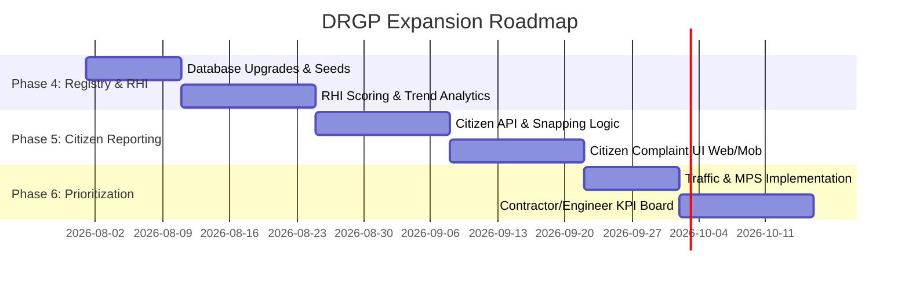

# Digital Roads Governance Platform (DRGP) - Gap Analysis & Roadmap

This document provides a comprehensive technical analysis comparing the current implementation of the **SmartRoad AP** project against the specifications and vision outlined in the two governance documents:
1. `TECHNICAL CONCEPT NOTE.docx` (Version 1.0)
2. `Digital Roads Governance Platform.docx` (Concept Note)

---

## 1. Executive Summary

The vision of the **Digital Roads Governance Platform (DRGP)** is to transition road maintenance from a reactive, complaint-driven model to a predictive, evidence-based, and highly accountable governance ecosystem. 

The project currently has a robust and highly developed foundation in **AI Detection (YOLOv12)**, **Survey Tracking (GIS / Mobile Chunks)**, and **Vendor Operations (Work Order Verification & Warranty)**. However, the system currently lacks the central metadata models, citizen interface, and decision-support algorithms that define the DRGP. 

### Core Gaps Identified:
1. **No Relational Road Registry**: The system handles GIS roads as static geometry file segments from OpenStreetMap on-disk, but lacks a relational `roads` database registry linking segments to contractors, construction costs, warranties, and histories.
2. **No Road Health Index (RHI) scoring**: Potholes are detected and scored for severity, and report statistics show pothole density per kilometer, but there is no monthly RHI metric (0-100 scale: Excellent to Critical) calculated per road.
3. **No Citizen Reporting System**: Citizen-facing endpoints, tables, and workflows are completely unimplemented.
4. **No Traffic Classification**: Dynamic road traffic class tracking (High/Medium/Low) is missing.
5. **No Maintenance Priority Score (MPS)**: The decision-support algorithm that computes repair priorities using RHI, Traffic, Complaints, and Warranty is unimplemented.

---

## 2. Current Implementation Status (What Has Been Done)

The codebase contains a mature architecture structured into a Flask JSON API and React frontend, alongside Flutter and Expo mobile clients. Below is the mapping of how current features are implemented:

*   **AI Detection Pipeline ([pothole_detector.py](file:///d:/Docs/Problem%20Solving/Forks/smart_road_app/pothole_detector.py))**:
    *   Uses YOLOv12 weights ([model_loader.py](file:///d:/Docs/Problem%20Solving/Forks/smart_road_app/model_loader.py)) to process videos/images.
    *   Supports hardware-accelerated video decoding/encoding ([ffmpeg_accel.py](file:///d:/Docs/Problem%20Solving/Forks/smart_road_app/ffmpeg_accel.py)) and parallel segment extraction.
    *   Features a custom dust filter ([dust_guard.py](file:///d:/Docs/Problem%20Solving/Forks/smart_road_app/dust_guard.py)) to reduce false positives.
    *   Deduplicates overlapping boundary detections across chunks.
*   **Survey Daily Assignments & GIS snaps ([survey_service.py](file:///d:/Docs/Problem%20Solving/Forks/smart_road_app/routes/survey_service.py))**:
    *   Caches OpenStreetMap road segments by district and state.
    *   Indexes segment midpoints using a grid snapping index (`*.snap.pkl` files) for sub-second lookup of the nearest road segment to avoid boundary mislabeling.
    *   Maintains daily assignments (`survey_daily_assignments` table) and tracking paths (`tracking_sessions`).
*   **Mobile Field Ingest ([field_upload_service.py](file:///d:/Docs/Problem%20Solving/Forks/smart_road_app/routes/field_upload_service.py))**:
    *   Field capture via Expo ([mobile_app](mobile_app/)) streams ~60s video segments along with high-frequency GPS logs.
    *   Chunks are processed and finalized asynchronously using a worker queue ([finalize_queue.py](file:///d:/Docs/Problem%20Solving/Forks/smart_road_app/routes/finalize_queue.py) / [smartroad_worker.py](file:///d:/Docs/Problem%20Solving/Forks/smart_road_app/scripts/smartroad_worker.py)).
*   **Vendor Operations & QA ([validation.py](file:///d:/Docs/Problem%20Solving/Forks/smart_road_app/routes/validation.py))**:
    *   Work orders (`work_orders` table) track transitions from `Created` to `Completed` ([constants.py](file:///d:/Docs/Problem%20Solving/Forks/smart_road_app/routes/constants.py)).
    *   Completion validation compares the vendor's submitted "after" photo coordinates against the target geofence (30m), checks timestamp constraints, and automatically re-runs YOLO to ensure the pothole has been repaired.
    *   Successfully verified work orders automatically initiate a warranty record (`warranty_records` table) and schedule maintenance.

---

## 3. Module-by-Module Gap Analysis

Here is a detailed mapping of the 8 core modules specified in the concept notes versus the actual codebase:

| DRGP Module | Specs / Requirements | Current Implementation Status | Gap / What is Missing |
| :--- | :--- | :--- | :--- |
| **Module 1: Digital Road Registry** | Permanent Road ID, GIS coords, Class, Cost, Contractor, Warranty Expiry, Last Maintenance, Last Inspection, Current RHI. | **Partially Implemented**<br>- Static segment indexes in GeoJSON exist on disk.<br>- No SQL table exists for the registry. | - Create a `roads` database table.<br>- Store metadata (Contractor, cost, construction agency, funding) in DB.<br>- Link segments to work orders and histories dynamically. |
| **Module 2: Road Observer Network** | Motorcycle + Mobile + App. Target: 2,000–2,500 km per observer per month. | **Fully Implemented**<br>- Survey assignments, GPS tracking, and mobile apps are fully active. | - N/A (operational policy). |
| **Module 3: Road Inspection Mobile App** | Geo-tagging, video/image capture, offline support, defect logging, automatic chainage. | **Fully Implemented**<br>- Flutter and Expo RN apps support geofenced tracking, capture, and chunked upload. | - Add local offline storage database on mobile clients if required. |
| **Module 4: Artificial Intelligence** | Detect potholes, cracks, rutting, edge failure, water logging, surface/shoulder damage, missing signs. | **Partially Implemented**<br>- YOLOv12 model detects potholes.<br>- Multi-class weights registry in `tools/ml/` supports comparison. | - Retrain/expand YOLO models to detect other defects (cracks, missing signs, edge failures, water logging). |
| **Module 5: Road Health Index (RHI)** | 0–100 numerical pavement health score (Excellent to Critical). Track monthly trends. | **Unimplemented**<br>- Report service computes pothole density per km, but does not calculate or log a standard 0-100 RHI. | - Implement RHI formula in backend.<br>- Create RHI history tracking table.<br>- Create RHI dashboard indicators. |
| **Module 6: Citizen Reporting System** | Real-time complaint submission (Photo + auto GPS + auto Road ID). Resolution workflow. Citizen Alerts shouldn't edit RHI directly. | **Unimplemented**<br>- No citizen tables, mobile screens, alert endpoints, or workflows exist. | - Build citizen complaint API & database tables.<br>- Implement snap-to-road ID lookup for complaints.<br>- Build resolution workflow (Verify -> Inspect -> Repair -> Close). |
| **Module 7: Traffic Classification** | Dynamic Traffic Class (High / Medium / Low) to prioritize maintenance over admin categories. | **Unimplemented**<br>- No database field or logic exists for traffic tracking. | - Add `traffic_class` (H/M/L) to road definitions.<br>- Expose field on dashboards. |
| **Module 8: Maintenance Priority Score (MPS)** | Algorithm using RHI, Traffic Class, Complaints, Strategic Importance, and Warranty to rank repairs and budget. | **Unimplemented**<br>- Report service uses simple pothole density for sorting, but lacks a multi-factor priority score. | - Design and code the MPS algorithm.<br>- Display prioritized segments on dashboards and budget sheets. |

---

## 4. Technical Design & Proposed Solutions

To align the codebase with the concept notes, the following database schemas, backend services, and algorithms are proposed:

### A. Database Schema Upgrades ([schema.sql](file:///d:/Docs/Problem%20Solving/Forks/smart_road_app/schema.sql))
We will introduce tables for the **Digital Road Registry**, **Road Health Index History**, **Citizen Complaints**, and **Traffic Classification**:

```sql
-- 1. Digital Road Registry Table
CREATE TABLE IF NOT EXISTS roads (
    id                      TEXT PRIMARY KEY,              -- Permanent Digital Road ID
    road_name               TEXT NOT NULL,
    from_location           TEXT,
    to_location             TEXT,
    road_category           TEXT CHECK (road_category IN ('NH', 'SH', 'MDR', 'Urban', 'Rural', 'Other')),
    state_id                INTEGER NOT NULL,
    district_id             INTEGER NOT NULL,
    constituency            TEXT,
    mandal                  TEXT,
    village_ward            TEXT,
    length_km               NUMERIC(8,3) NOT NULL,
    width_m                 NUMERIC(5,2),
    lanes                   INTEGER DEFAULT 2,
    surface_type            TEXT DEFAULT 'BT',              -- BT (Bituminous) / CC (Concrete) / Gravel / Others
    construction_date       DATE,
    construction_agency     TEXT,                           -- PWD / NHAI / PR, etc.
    contractor_name         TEXT,
    project_cost            NUMERIC(14,2),
    funding_source          TEXT,
    warranty_expiry_date    DATE,
    last_maintenance_date   DATE,
    last_inspection_date    DATE,
    current_rhi             INTEGER DEFAULT 100,            -- Current Road Health Index (0-100)
    traffic_class           CHAR(1) DEFAULT 'L' CHECK (traffic_class IN ('H', 'M', 'L')),
    strategic_importance    INTEGER DEFAULT 1 CHECK (strategic_importance BETWEEN 1 AND 5), -- 1 (Low) to 5 (Critical)
    geom                    GEOMETRY(LINESTRING, 4326),     -- PostGIS geometry
    created_at              TIMESTAMP WITH TIME ZONE DEFAULT NOW()
);

-- 2. Road Health Index (RHI) Monthly Trend Table
CREATE TABLE IF NOT EXISTS road_health_history (
    id              SERIAL PRIMARY KEY,
    road_id         TEXT NOT NULL REFERENCES roads(id) ON DELETE CASCADE,
    inspection_date DATE NOT NULL,
    score           INTEGER NOT NULL CHECK (score BETWEEN 0 AND 100),
    condition_class TEXT NOT NULL,                          -- Excellent / Good / Fair / Poor / Critical
    pothole_count   INTEGER DEFAULT 0,
    other_defect_count INTEGER DEFAULT 0,
    created_at      TIMESTAMP WITH TIME ZONE DEFAULT NOW(),
    UNIQUE (road_id, inspection_date)
);

-- 3. Citizen Complaints Table
CREATE TABLE IF NOT EXISTS citizen_complaints (
    id                  SERIAL PRIMARY KEY,
    tracking_number     TEXT UNIQUE NOT NULL,              -- Auto-generated tracking ID
    road_id             TEXT REFERENCES roads(id) ON DELETE SET NULL, -- Snapped automatically
    defect_type         TEXT NOT NULL,                     -- Pothole, Water Logging, Broken Shoulder, Missing Sign, etc.
    latitude            DOUBLE PRECISION NOT NULL,
    longitude           DOUBLE PRECISION NOT NULL,
    location            GEOMETRY(POINT, 4326),
    photo_s3_url        TEXT,
    description         TEXT,
    reporter_phone      TEXT,
    reporter_email      TEXT,
    status              TEXT NOT NULL DEFAULT 'Submitted',  -- Submitted / Verified / WorkOrder_Created / Resolved / Closed
    engineer_id         INTEGER REFERENCES users(id),       -- Assigned inspector
    contractor_notified BOOLEAN DEFAULT FALSE,
    created_at          TIMESTAMP WITH TIME ZONE DEFAULT NOW(),
    updated_at          TIMESTAMP WITH TIME ZONE DEFAULT NOW()
);
```

### B. Road Health Index (RHI) Scoring Logic
The RHI translates detected pavement distress into a standard metric. The deduction-based score can be calculated as:

$$\text{RHI} = \max\left(0, 100 - \sum \text{Deduction Points}\right)$$

```python
def calculate_road_health_index(length_km: float, defects: list[dict]) -> int:
    """
    Computes RHI on a 0-100 scale.
    Deductions are normalized per kilometer to prevent longer roads from being penalized.
    """
    if length_km <= 0:
        return 100
    
    # Severity weighting rules
    deduction_rates = {
        "High": 20,    # Large potholes / critical defects
        "Medium": 10,  # Medium defects
        "Low": 5       # Minor defects
    }
    
    total_deductions = 0.0
    for defect in defects:
        severity = defect.get("severity", "Low")
        weight = deduction_rates.get(severity, 5)
        total_deductions += weight
        
    # Normalize deductions per km
    normalized_deduction = total_deductions / length_km
    score = 100 - int(normalized_deduction)
    
    return max(0, min(100, score))
```

### C. Maintenance Priority Score (MPS) Algorithm
The MPS prioritizes maintenance actions using the following equation:

$$\text{MPS} = w_1 \times (100 - \text{RHI}) + w_2 \times \text{TrafficWeight} + w_3 \times \text{ComplaintWeight} + w_4 \times \text{StrategicWeight} + w_5 \times \text{WarrantyWeight}$$

Where weights total `1.0` (e.g., $w_1 = 0.4$, $w_2 = 0.2$, $w_3 = 0.15$, $w_4 = 0.15$, $w_5 = 0.1$):

```python
def compute_mps(road: dict, active_complaints_count: int) -> float:
    """
    Computes the Maintenance Priority Score (MPS) from 0 to 100.
    A higher MPS indicates higher repair priority.
    """
    rhi = road.get("current_rhi", 100)
    traffic = road.get("traffic_class", "L")
    strategic = road.get("strategic_importance", 1) # 1 to 5
    is_under_warranty = road.get("warranty_expiry_date") is not None and road["warranty_expiry_date"] >= datetime.today().date()
    
    # Weight maps
    traffic_weights = {"H": 100, "M": 60, "L": 20}
    complaint_weight = min(100, active_complaints_count * 20) # Caps at 5 complaints
    strategic_weight = strategic * 20 # scale 1-5 to 0-100
    warranty_weight = 0 if is_under_warranty else 100 # Higher priority if NOT under warranty (government expense)
    
    # Calculate weighted score
    score = (
        0.40 * (100 - rhi) +
        0.20 * traffic_weights.get(traffic, 20) +
        0.15 * complaint_weight +
        0.15 * strategic_weight +
        0.10 * warranty_weight
    )
    return round(score, 2)
```

---

## 5. Execution Roadmap

To achieve full DRGP compliance, we recommend structured developmental phases:



### Phase 4: Road Registry & RHI Implementation (Est: 3 Weeks)
*   Deploy new SQL schema migrations for the `roads` and `road_health_history` tables.
*   Import existing OSM GIS segment files into the Postgres `roads` table using GeoPandas/PostGIS.
*   Expose endpoints to fetch and manage road registry metadata.
*   Create a monthly calculation scheduler to compute RHI and populate the `road_health_history` trend database.

### Phase 5: Citizen Reporting & Resolution Workflow (Est: 4 Weeks)
*   Create `citizen_complaints` endpoints (`POST /api/complaints/submit`).
*   Implement automatic GIS snapping on complaint submit to link the coordinate directly to a registry `Road ID` using the existing snap grids.
*   Implement automatic email/SMS dispatch notifications when a complaint is registered.
*   Build a citizen complaint list and details tab in the React Admin panel.

### Phase 6: Maintenance Prioritization & Performance Dashboards (Est: 3 Weeks)
*   Implement the Maintenance Priority Score (MPS) calculator.
*   Build high-level analytics charts on the dashboard tracking:
    *   **Contractor Performance**: Average repair times, warranty defects, and citizen satisfaction ratings.
    *   **Engineer Performance**: Open inspections and response times.
    *   **Pavement Health Overview**: State/District aggregate RHI maps and trend graphs.
