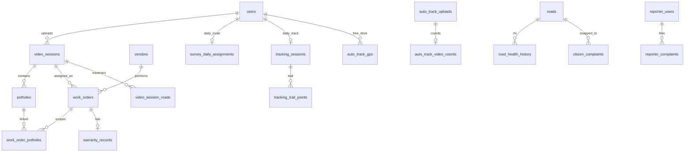

# SmartRoad AP — Database & PostGIS

How PostgreSQL + PostGIS backs the current application: schema ownership, who writes what, spatial columns, and ops commands.

---

## 1. What runs the database

| Piece | Role |
|-------|------|
| **PostgreSQL** | System of record for users, detection sessions, work orders, survey assignments, tracking, complaints, etc. |
| **PostGIS** | Spatial types (`GEOMETRY`), GiST indexes, and SQL helpers (`ST_MakePoint`, `ST_DWithin`, `ST_Distance`, …) |
| **`schema.sql`** | Idempotent baseline DDL (`CREATE TABLE IF NOT EXISTS`, extension, indexes). Applied by `db_utils.init_db()` on app start when DB is configured |
| **`migrations/*.sql`** | Dated upgrades (roles, reporter, roads registry, …). Apply with `python scripts/apply_db_migrations.py` (skips stems already in `schema_migrations`) |
| **`db_utils.py`** | Only module that opens pool connections for most CRUD |
| **`db/gis_state.py`** | Survey/tracking dual-write helpers (often with PostGIS points/lines) |

DB is **optional** for some local demos (detect without persistence). Production expects Postgres + PostGIS.

Connection settings come from `.env` (`DB_HOST`, `DB_PORT`, `DB_NAME`, `DB_USER`, `DB_PASSWORD`, …). Never commit real credentials.

---

## 2. Roles stored in `users.role`

| DB value | UI label | Meaning |
|----------|----------|---------|
| `DevAdmin` | Dev Admin | Platform / engineering: Users, Detection, Model bench, complaints staff, full ops |
| `Admin` | Admin | Field ops: Admin dashboard, tracking, survey admin, reports, videographers |
| `Allocator` | Allocator | Vendors + create/allocate work orders |
| `Supervisor` | Supervisor | Review / SLA views |
| `Vendor` | Vendor | Own vendor tasks |
| `Videographer` | Videographer | Survey, capture, upload |

Helpers (`routes/user_model.py`):

- `is_dev_admin()` → `DevAdmin`
- `is_admin()` → field `Admin`
- `can_manage_field_ops()` → Admin **or** DevAdmin
- `is_supervisor()` / `is_allocator()` include DevAdmin (same as legacy full Admin)

Auth `/api/auth/me` and JWT expose `is_admin` (field Admin) and `is_dev_admin` (DevAdmin).

---

## 3. Table map (by domain)

Authoritative comments and columns: **`schema.sql`**. Per-table detail (all 32 tables): **§10–11** below.

### Detection & reports

| Table | Purpose |
|-------|---------|
| `video_sessions` | One processed media run (filename, S3 key, run_id, counts, labels) |
| `potholes` | Per-detection boxes, severity, lat/lon, **`location` POINT**, frame URL, address fields |
| Session report keys | `report_s3_key` / timestamps on `video_sessions` |

### Identity & vendors

| Table | Purpose |
|-------|---------|
| `users` | Login, role, `state_id`, `district_id` / `district_ids`, optional `vendor_id` |
| `vendors` | Contractor companies |
| `vendor_zones` | Service polygons (**`boundary` POLYGON**) |
| `vg_details` | Display name / mobile / village for videographers (field Admin CRUD) |

### Work orders

| Table | Purpose |
|-------|---------|
| `work_orders` | Status machine (Created → … → Verified/Failed) |
| `work_order_potholes` | Links WO ↔ potholes |
| `status_history` | Transitions |
| `completion_validations` | GPS/time/re-YOLO validation |
| `warranty_records`, `escalations` | Warranty / escalation |

### Survey & tracking

| Table | Purpose |
|-------|---------|
| `survey_settings` | Daily km / focus class |
| `survey_daily_assignments` | Per VG day: corridor, covered km, **`start_geom` / `end_geom` / `route_geom`**, JSON legs/polyline |
| `survey_segment_status` | Segment availability |
| `survey_cleared_assignments` | Cleared assignment history |
| `tracking_sessions` | Day session: covered_km, `covered_by_class`, **`last_geom`** |
| `tracking_trail_points` | Ping trail: lat/lon, **`geom`**, `delta_km`, `road_class` |

### Auto-track / field linkage

| Table | Purpose |
|-------|---------|
| `auto_track_gps` | GPS track geometry (**`gps_geom` LINESTRING**) |
| `auto_track_video_coords` | Video coord lines (**`coord_geom`**) |
| related auto_track tables | Upload verify / linkage |

### Roads registry (DRGP)

| Table | Purpose |
|-------|---------|
| `roads` | Digital road registry segments (often with **`geom`**, centroid, length, class) |
| `video_session_roads` | Session ↔ road links |

### Citizen reporter

| Table | Purpose |
|-------|---------|
| `reporter_users` | Mobile OTP login (separate from staff `users`) |
| `reporter_otp_challenges` / `reporter_otp_codes` | OTP issue + verify (hashed challenges; plaintext mirror for dev) |
| `reporter_complaints` | Citizen-uploaded defects with GPS + S3 media |
| `citizen_complaints` | DRGP staff-facing complaint registry (links to `roads`, `work_orders`) |

### Ops bookkeeping

| Table | Purpose |
|-------|---------|
| `schema_migrations` | Applied migration stems |

---

## 4. How PostGIS is used

### Extension

```sql
CREATE EXTENSION IF NOT EXISTS postgis;
```

SRID **4326** (WGS84 lon/lat) everywhere.

### Geometry columns (app)

| Column | Type | Used for |
|--------|------|----------|
| `potholes.location` | `POINT` | Spatial index on detections; nearest-road / distance queries |
| `vendor_zones.boundary` | `POLYGON` | Vendor service area |
| `survey_daily_assignments.start_geom` / `end_geom` | `POINT` | Assignment endpoints |
| `survey_daily_assignments.route_geom` | `LINESTRING` | Driven / planned corridor |
| `tracking_sessions.last_geom` | `POINT` | Last known fix |
| `tracking_trail_points.geom` | `POINT` | Trail points (GiST) |
| `auto_track_*.gps_geom` / `coord_geom` | `LINESTRING` | Track vs video geometry |
| `roads.geom` (+ centroid) | geometry | Registry matching / distance |

Indexes are **GiST** (e.g. `idx_potholes_location`, `idx_tracking_trail_geom`, `idx_survey_assign_route`).

### Typical SQL patterns in code

- **Write a point from lat/lon**  
  `ST_SetSRID(ST_MakePoint(lon, lat), 4326)`  
  (lon first — PostGIS convention.) Used when inserting trail points and assignment endpoints (`db/gis_state.py`).

- **Distance / nearest**  
  `ST_DWithin`, `ST_Distance(...::geography)`, KNN `<->` on geometries — e.g. reporter ↔ roads (`routes/reporter_service.py`), seed/registry scripts.

- **Lines from WKT/GeoJSON**  
  `ST_GeomFromText` / `ST_GeomFromGeoJSON` when persisting GPS polylines or registry imports.

### What PostGIS is *not*

Heavy road-network snapping for survey **locate** mainly uses on-disk GIS under `data/gis_states/` (GeoJSON + `*.snap.pkl`), not a full PostGIS road graph. PostGIS stores **operational** geometries (trails, assignments, pothole pins, registry) so SQL can filter and measure them quickly.

---

## 5. Dual-write: DB + JSON / files

Some field features still mirror JSON under `data/gis/` (and GIS assets under `data/gis_states/`, gitignored). Postgres is canonical for tracking sessions/trails and survey assignments when configured; JSON remains a fallback / import path (`scripts/migrate_survey_tracking_to_db.py`).

S3 holds media; DB stores keys and metadata. Successful detection typically **moves** input objects to the processed bucket — input listing = still awaiting auto-detect.

---

## 6. Auto-detect & queues (related to DB results)

| Queue | Path | Writer | Consumer |
|-------|------|--------|----------|
| Finalize | `data/finalize_queue/` | Upload API | `scripts/smartroad_worker.py` |
| Detect | `data/detect_queue/` | Finalize side effects + S3 scan | same worker |

Detection writes `video_sessions` / `potholes` (with `location`) via the detection pipeline. One detection at a time (file lock + sequential worker). **Defaults:** auto-detect is **off** locally; **on** when `SMARTROAD_ENV=production` (override with `AUTO_DETECT_ON_UPLOAD`, `AUTO_DETECT_SCAN_S3`).

---

## 7. Apply / verify ops

```bash
# Baseline + all pending migrations (skips already recorded stems)
python scripts/apply_db_migrations.py

# Or baseline only
python -c "import db_utils; db_utils.init_db()"

# First platform user (DevAdmin)
python scripts/bootstrap_admin.py
```

Check PostGIS:

```sql
SELECT PostGIS_Version();
SELECT role, count(*) FROM users GROUP BY 1;
SELECT id FROM schema_migrations ORDER BY 1;
```

---

## 8. Security notes (DB-facing)

- Prefer least privilege DB user (DML on app tables; avoid superuser in app `.env`).
- Role checks are enforced in API helpers (`_dev_admin_only` = DevAdmin, `_field_ops` = field Admin + DevAdmin, `_staff_ops_only` = vendors/tasks staff — **not** field-only Admin).
- Do not expose raw SQL or connection strings to clients.
- Rotate `FLASK_SECRET_KEY` / JWT secrets and bootstrap passwords after first deploy (see [SECURITY.md](SECURITY.md), [DEPLOYMENT.md](DEPLOYMENT.md)).

---

## 9. Related docs

| Doc | Topic |
|-----|--------|
| [schema.sql](../../schema.sql) | Full DDL |
| [migrations/](../../migrations/) | Incremental SQL |
| [DEPLOYMENT.md](DEPLOYMENT.md) | Install Postgres/PostGIS |
| [PROJECT_SETUP.md](PROJECT_SETUP.md) | Local env, GPS log shapes |
| [tools/gis/README.md](../../tools/gis/README.md) | Building `data/gis_states/` |
| [MULTI_SERVICE.md](MULTI_SERVICE.md) | Portal / upload / detect / worker |

---

## 10. Full table index (32 tables)

Authoritative DDL: [`schema.sql`](../../schema.sql) plus [`migrations/`](../../migrations/). Baseline tables live in `schema.sql`; DRGP registry and reporter portal tables were added in dated migrations (`20260720_drgp_road_registry.sql`, `20260720_reporter_portal.sql`, …).

| # | Table | Domain | PostGIS | Primary writers / readers |
|---|-------|--------|---------|---------------------------|
| 1 | `schema_migrations` | Ops | — | `apply_db_migrations.py`, migration SQL |
| 2 | `video_sessions` | Detection | — | `db/sessions.py`, detection pipeline; read: Tracker, tasks, reports |
| 3 | `potholes` | Detection | POINT | `db/sessions.py` (batch insert); read: maps, work-order linking |
| 4 | `users` | Auth | — | `routes/api/users.py`, bootstrap script; read: all auth |
| 5 | `vendors` | Vendors | — | `routes/api/vendors.py` |
| 6 | `vendor_zones` | Vendors | POLYGON | vendor API / allocation helpers |
| 7 | `work_orders` | Work orders | — | `db/work_orders.py`, `routes/api/tasks.py` |
| 8 | `work_order_potholes` | Work orders | — | task allocation / status updates |
| 9 | `status_history` | Work orders | — | status transition handlers |
| 10 | `completion_validations` | Validation | — | `routes/validation.py` |
| 11 | `warranty_records` | Work orders | — | task completion flows |
| 12 | `escalations` | Work orders | — | SLA / escalation jobs |
| 13 | `survey_settings` | Survey | — | `routes/survey/*`, `db/gis_state.py` |
| 14 | `survey_daily_assignments` | Survey | POINT, LINESTRING | `db/gis_state.py`, survey service |
| 15 | `survey_segment_status` | Survey | — | survey progress / seed sync |
| 16 | `survey_cleared_assignments` | Survey | — | `db/gis_state.py` (soft-clear archive) |
| 17 | `tracking_sessions` | Tracking | POINT | `db/gis_state.py`, tracking service |
| 18 | `tracking_trail_points` | Tracking | POINT | chunk upload pings, `/api/tracking/ping` |
| 19 | `auto_track_gps` | Auto-track | LINESTRING | `routes/auto_track_service.py` |
| 20 | `auto_track_uploads` | Auto-track | — | upload finalize side effects |
| 21 | `auto_track_video_coords` | Auto-track | LINESTRING | GPS log extracted on upload |
| 22 | `vg_details` | Field ops | — | `routes/api/vg_details.py` |
| 23 | `roads` | DRGP registry | geom, centroid | `scripts/seed_roads_registry.py` |
| 24 | `road_health_history` | DRGP | — | schema ready; populated by future RHI jobs |
| 25 | `road_traffic_profiles` | DRGP | — | schema ready; survey GPS aggregation |
| 26 | `citizen_complaints` | DRGP | POINT | schema ready; staff complaint desk |
| 27 | `road_maintenance_events` | DRGP | — | schema ready; maintenance audit trail |
| 28 | `video_session_roads` | DRGP | — | schema ready; session ↔ road summary |
| 29 | `reporter_users` | Reporter portal | — | `routes/reporter_service.py` |
| 30 | `reporter_otp_challenges` | Reporter portal | — | OTP issue / verify |
| 31 | `reporter_otp_codes` | Reporter portal | — | dev/test OTP mirror |
| 32 | `reporter_complaints` | Reporter portal | POINT | reporter mobile uploads |

**Dropped (do not expect in DB):** `reporter_passkeys`, `reporter_http_devices`, … removed by `20260720_reporter_otp_restore.sql`.

---

## 11. Table reference (detailed)

Each subsection lists purpose, keys, spatial columns, and which app modules touch the table. Column lists are abbreviated — see `schema.sql` for every default and CHECK constraint.

### 11.1 Ops

#### `schema_migrations`

| | |
|---|---|
| **Purpose** | Records which dated migration stems have been applied so `apply_db_migrations.py` can skip them. |
| **Primary key** | `id` (TEXT) — migration filename stem, e.g. `20260727_vg_details`. |
| **Columns** | `applied_at` TIMESTAMPTZ (default NOW). |
| **Written by** | Each `migrations/*.sql` file (`INSERT INTO schema_migrations … ON CONFLICT DO NOTHING`) and the apply script. |
| **Notes** | Not the same as Alembic; this repo uses raw SQL files only. |

---

### 11.2 Detection & reports

#### `video_sessions`

| | |
|---|---|
| **Purpose** | One row per YOLO inference run on a video or image (field upload, S3 catalog, or manual Detection page). |
| **Primary key** | `id` SERIAL. |
| **Foreign keys** | `user_id` → `users(id)` ON DELETE SET NULL (nullable for legacy/admin runs). |
| **Key columns** | `filename`, `s3_key`, `run_id`, `processed_at`, `total_potholes`, `video_duration_sec`, `username` / `display_name`, `start_label` / `end_label` (route context from field metadata), `report_s3_key` / `report_generated_at` (PDF/HTML report in S3), `is_legacy` (pre-metadata imports). |
| **Indexes** | `run_id`, `processed_at`, `username`, `user_id`. |
| **Written by** | `db/sessions.py` after `pothole_detector.py` / detection API completes. |
| **Read by** | Detection catalog, Tracker dashboard (video KPIs), work-order creation (`session_id`), DRGP `road_health_history` / `video_session_roads` (when populated). |
| **Related** | Input S3 objects are moved to processed bucket on success; rows remain even if media is only local (no S3). |

#### `potholes`

| | |
|---|---|
| **Purpose** | Individual detections belonging to a session — bounding box, severity, geolocation, frame snapshot. |
| **Primary key** | `id` SERIAL. |
| **Foreign keys** | `session_id` → `video_sessions(id)` ON DELETE CASCADE. |
| **PostGIS** | `location` GEOMETRY(POINT, 4326) — populated from `longitude`, `latitude` when both present. |
| **Key columns** | `class_name`, `confidence`, `severity` (Low/Medium/High heuristic), `x1..y2`, lat/lon, `captured_at`, `map_link`, `frame_s3_url`, GPS log extras (`altitude`, `accuracy`, `speed`, `cumulative_distance_meters`), reverse-geocode fields (`street_name`, `city`, `state`, …). |
| **Indexes** | GiST on `location`; btree on `session_id`, `severity`, `created_at`. |
| **Written by** | `db/sessions.py` batch insert from detection pipeline. |
| **Read by** | Pothole maps, Tracker KPI drill-downs, work-order pothole linking, validation re-YOLO. |

---

### 11.3 Identity & vendors

#### `users`

| | |
|---|---|
| **Purpose** | Staff portal accounts (Flask-Login + mobile JWT for videographers). |
| **Primary key** | `id` SERIAL. |
| **Uniqueness** | `username` UNIQUE. |
| **Foreign keys** | `vendor_id` → `vendors(id)` ON DELETE SET NULL (when `role = Vendor`). |
| **Key columns** | `password_hash`, `full_name`, `email`, `role` (CHECK: DevAdmin, Admin, Allocator, Supervisor, Vendor, Videographer), `state_id` (1=AP, 2=TG for videographers), `district_id` / `district_ids[]` (LGD codes), `is_active`, `last_login`, `token_version` (bump on logout to invalidate JWTs). |
| **Indexes** | `role`, `vendor_id`, `state_id`, `district_id`. |
| **Written by** | Users API, bootstrap admin, vg_details create flow. |

#### `vendors`

| | |
|---|---|
| **Purpose** | Contractor companies that receive allocated work orders. |
| **Primary key** | `id` SERIAL. |
| **Uniqueness** | `registration_number` UNIQUE (CIN/UCIN). |
| **Key columns** | Company/contact fields, `specializations[]`, `max_active_tasks`, `performance_score` (0–100), `status` (Active/Suspended/Blacklisted). |
| **Written by** | Vendors API (`Allocator`+ staff). |

#### `vendor_zones`

| | |
|---|---|
| **Purpose** | Geographic service areas per vendor for allocation filtering. |
| **Primary key** | `id` SERIAL. |
| **Foreign keys** | `vendor_id` → `vendors(id)` CASCADE. |
| **PostGIS** | `boundary` GEOMETRY(POLYGON, 4326) with GiST index. |
| **Key columns** | `zone_name`. |

#### `vg_details`

| | |
|---|---|
| **Purpose** | Extended videographer profile (display name, mobile, village) managed by field Admin / DevAdmin. |
| **Primary key** | `user_id` → `users(id)` CASCADE (1:1 with Videographer users). |
| **Key columns** | `display_name`, `mobile`, `village`, `notes`, `created_at`, `updated_at`. |
| **Indexes** | `mobile`. |
| **Written by** | `routes/api/vg_details.py`. |
| **Read by** | Videographers admin page, Tracker active-members drill-down. |

---

### 11.4 Work orders & validation

#### `work_orders`

| | |
|---|---|
| **Purpose** | Assign a detection session (pothole set) to a vendor with SLA tracking. |
| **Primary key** | `id` SERIAL. |
| **Foreign keys** | `session_id` → `video_sessions`, `vendor_id` → `vendors` SET NULL. |
| **Key columns** | `status` (Created → Allocated → WIP → Completed → Verified/Failed), `sla_tier`, `sla_due_date`, milestone timestamps (`allocated_at`, `started_at`, `completed_at`, `verified_at`), `estimated_budget` / `actual_spend`, `remarks`, `created_by` / `allocated_by`. |
| **State machine** | Enforced in API via `routes/constants.py: VALID_TRANSITIONS`. |
| **Indexes** | `session_id`, `vendor_id`, `status`, `sla_due_date`. |

#### `work_order_potholes`

| | |
|---|---|
| **Purpose** | Many-to-many link: which potholes are in scope for a work order and per-pothole repair status. |
| **Primary key** | `id` SERIAL. |
| **Uniqueness** | `(work_order_id, pothole_id)`. |
| **Foreign keys** | `work_order_id` CASCADE, `pothole_id` → `potholes`. |
| **Key columns** | `status` (Pending/InProgress/Repaired/Verified/Failed), `repair_sequence` (route order). |

#### `status_history`

| | |
|---|---|
| **Purpose** | Append-only audit log for work-order and pothole status changes. |
| **Primary key** | `id` SERIAL. |
| **Key columns** | `entity_type` (`work_order` \| `pothole`), `entity_id`, `from_status`, `to_status`, `comment`, `changed_by`, `changed_at`. |
| **Index** | `(entity_type, entity_id)`. |

#### `completion_validations`

| | |
|---|---|
| **Purpose** | Post-repair validation: GPS proximity, timestamp, optional re-YOLO on "after" photo. |
| **Primary key** | `id` SERIAL. |
| **Foreign keys** | `work_order_id` CASCADE; `pothole_id` SET NULL (NULL = session-level check). |
| **Key columns** | `after_photo_s3_url`, lat/lon/timestamp/hash, `gps_distance_meters`, `gps_check` / `timestamp_check`, YOLO fields (`yolo_pothole_detected`, `yolo_confidence`, `yolo_severity`), `ai_result`, `resolution_score`, `final_result`, reviewer fields. |

#### `warranty_records`

| | |
|---|---|
| **Purpose** | One warranty row per completed work order — expiry and maintenance schedule. |
| **Primary key** | `id` SERIAL. |
| **Uniqueness** | `work_order_id` UNIQUE. |
| **Key columns** | `warranty_period_months`, start/expiry dates, `next_maintenance_date`, `maintenance_interval_months`, `warranty_status`, `claim_count`. |
| **Index** | `warranty_expiry_date`. |

#### `escalations`

| | |
|---|---|
| **Purpose** | SLA breach / severity / monsoon escalation notifications tied to a work order. |
| **Primary key** | `id` SERIAL. |
| **Foreign keys** | `work_order_id` CASCADE. |
| **Key columns** | `escalation_type`, `escalated_at`, `notified_to`, `notification_method`, `resolved`, `resolved_at`. |

---

### 11.5 Survey & field tracking

#### `survey_settings`

| | |
|---|---|
| **Purpose** | Singleton admin config for daily survey targets. |
| **Primary key** | `id` = 1 (CHECK enforces single row). |
| **Key columns** | `daily_km` (default 100), `focus_road_class` (default `all`), `updated_at`. |
| **Seed** | Row `(1, 100, 'all')` inserted idempotently on schema init. |

#### `survey_daily_assignments`

| | |
|---|---|
| **Purpose** | One active route assignment per videographer per calendar day. |
| **Primary key** | `id` SERIAL. |
| **Uniqueness** | `(assignment_date, user_id)`. |
| **Foreign keys** | `user_id` → `users` CASCADE. |
| **PostGIS** | `start_geom`, `end_geom` (POINT); `route_geom` (LINESTRING) — GiST indexes. |
| **Key columns** | `state_key`, `state_id`, `district_id`, `district_name`, `segment_ids[]`, start/end lat/lon + labels, `corridor_km`, `covered_km`, `covered_by_class` JSONB (km by nh/sh/mdr/other), `legs` JSONB, `polyline` JSONB (OSRM corridor), `route_km`, `continuous`, `preferred_km`, `connector_km`, `mode` (corridor/nearest/manual/auto_track), `meta` JSONB. |
| **Written by** | `db/gis_state.py`, `routes/survey/assignments.py` (generation modes). |
| **Dual-write** | Mirrored to `data/gis/assignments/*.json` when DB configured. |

#### `survey_segment_status`

| | |
|---|---|
| **Purpose** | Availability state of GIS segment IDs (from `data/gis_states/` network). |
| **Primary key** | `segment_id` TEXT (matches `{district_id}_{osm_id}` style IDs). |
| **Key columns** | `status` (available, assigned, completed, verified, approved, pending_approval), `updated_at`. |
| **Notes** | `scripts/seed_roads_registry.py` can sync statuses into `roads.survey_status`. |

#### `survey_cleared_assignments`

| | |
|---|---|
| **Purpose** | Archive when a videographer clears/abandons a day’s assignment without deleting history — allows later upload to “seal” against the old route even after a new assignment is generated. |
| **Primary key** | `id` SERIAL. |
| **Foreign keys** | `user_id` → `users` CASCADE. |
| **Key columns** | Snapshot of route (`segment_ids`, `polyline`, labels, km fields, `mode`, district/state), `entry_snapshot` JSONB, `cleared_at`, `consumed_at` / `consumed_note` when an upload claims this archive. |
| **Indexes** | `(user_id, assignment_date)`; partial index on open rows (`consumed_at IS NULL`). |
| **Written by** | `db/gis_state.py` soft-clear path in survey service. |

#### `tracking_sessions`

| | |
|---|---|
| **Purpose** | Per-user per-day aggregate tracking state (KM covered, last fix, recording flag). |
| **Primary key** | `id` SERIAL. |
| **Uniqueness** | `(user_id, track_date)`. |
| **Foreign keys** | `user_id` → `users` CASCADE. |
| **PostGIS** | `last_geom` POINT (GiST). |
| **Key columns** | Denormalized `username`, `full_name`, `state_id`, `district_id`, `recording`, `covered_km`, `covered_by_class` JSONB, `last_lat`/`last_lon`/`last_accuracy`/`last_ts`. |
| **Read by** | Tracker dashboard KPIs, live tracking map. |

#### `tracking_trail_points`

| | |
|---|---|
| **Purpose** | Ordered GPS pings for a tracking session (field capture chunks + occasional keepalive). |
| **Primary key** | `id` BIGSERIAL. |
| **Foreign keys** | `session_id` → `tracking_sessions` CASCADE. |
| **PostGIS** | `geom` POINT (GiST). |
| **Key columns** | `lat`, `lon`, `ts`, `capture_session_id` (mobile chunk session id), `committed` (false until chunk finalized), `delta_km` (segment distance; may be 0 — Tracker API can synthesize path distance), `road_class` (nh/sh/mdr/other when classified). |
| **Indexes** | `(session_id)`, GiST `geom`, `(session_id, ts)`. |
| **Notes** | High-frequency standalone ping loops were removed intentionally; most points arrive via chunk upload. |

---

### 11.6 Auto-track (GPS vs video verification)

#### `auto_track_gps`

| | |
|---|---|
| **Purpose** | Free-drive GPS track recorded on device before/around auto-track survey mode. |
| **Primary key** | `id` SERIAL. |
| **Foreign keys** | `user_id` → `users` CASCADE. |
| **Uniqueness** | Effectively one row per `(user_id, track_date)` in service logic. |
| **PostGIS** | `gps_geom` LINESTRING; `gps_points` JSONB mirror. |
| **Key columns** | Start/end lat/lon + labels, `covered_km`. |
| **Written by** | `routes/auto_track_service.py`, survey auto-track assignment, capture chunk side paths. |

#### `auto_track_uploads`

| | |
|---|---|
| **Purpose** | Each field video upload in auto-track flow with match result against GPS track. |
| **Primary key** | `id` SERIAL. |
| **Foreign keys** | `user_id` CASCADE; `gps_track_id` → `auto_track_gps` SET NULL. |
| **Key columns** | `video_title`, `upload_day`, `s3_key`, `match_score`, `match_status` (pending/matched/mismatch/no_gps_track). |
| **Written by** | `routes/upload_side_effects.py` → `auto_track_service.record_upload_and_verify`. |

#### `auto_track_video_coords`

| | |
|---|---|
| **Purpose** | GPS coordinates parsed from uploaded video’s sidecar log — compared to `auto_track_gps`. |
| **Primary key** | `id` SERIAL. |
| **Foreign keys** | `user_id` CASCADE; `upload_id` → `auto_track_uploads` CASCADE. |
| **PostGIS** | `coord_geom` LINESTRING; `coords` JSONB. |
| **Key columns** | `covered_km`. |

---

### 11.7 DRGP — digital road registry

These tables support the Digital Road Governance Platform (Phase 4). Schema and seed tooling exist; not all write paths are wired in the live portal yet.

#### `roads`

| | |
|---|---|
| **Purpose** | Canonical registry of road segments (OSM-clipped network aligned to LGD districts). |
| **Primary key** | `id` TEXT — same as `gis_segment_id` (`{district_id}_{osm_id}`). |
| **Foreign keys** | `vendor_id` → `vendors` SET NULL (maintenance contractor). |
| **PostGIS** | `geom` (any geometry type, 4326), `centroid` POINT — GiST indexes. |
| **Key columns** | `road_code` (human ID `SR-{AP\|TG}-…`), `road_name`, `osm_ref`, `road_class` (nh/sh/mdr/other), location hierarchy (state, district, mandal, …), `length_km`, surface/lanes, project/funding fields, `current_rhi` (0–100), `current_mps`, `traffic_class` (H/M/L), `survey_status`, `osm_id`, `source`, `import_batch_id`, `is_active`. |
| **Written by** | `scripts/seed_roads_registry.py` (from `data/gis_states/` GeoJSON). |
| **Read by** | Reporter road snap (`routes/reporter_service.py` nearest-road query). |

#### `road_health_history`

| | |
|---|---|
| **Purpose** | Time series of Road Health Index (RHI) scores per road segment. |
| **Primary key** | `id` SERIAL. |
| **Uniqueness** | `(road_id, inspection_date, source)`. |
| **Foreign keys** | `road_id` → `roads` CASCADE; `session_id` → `video_sessions` SET NULL. |
| **Key columns** | `score`, `condition_class` (Excellent…Critical), pothole counts by severity, `damage_index`, `analysed_length_km`, `source` (default `ai_survey`). |

#### `road_traffic_profiles`

| | |
|---|---|
| **Purpose** | Hourly/daily traffic level aggregates per road (from survey GPS speeds). |
| **Primary key** | `(road_id, day_of_week, hour_of_day)`. |
| **Foreign keys** | `road_id` → `roads` CASCADE. |
| **Key columns** | `average_speed_kmh`, `traffic_level` (H/M/L), `sample_count`, `source`. |

#### `citizen_complaints`

| | |
|---|---|
| **Purpose** | Staff-managed complaint records in DRGP (distinct from mobile `reporter_complaints`). |
| **Primary key** | `id` SERIAL. |
| **Uniqueness** | `tracking_number` UNIQUE. |
| **Foreign keys** | `road_id` → `roads`; `engineer_id` → `users`; `work_order_id` → `work_orders`. |
| **PostGIS** | `location` POINT; `snap_distance_m` to nearest road. |
| **Key columns** | `defect_type`, lat/lon, `photo_s3_url`, reporter contact fields, `status` lifecycle, `contractor_notified`, verification/resolution timestamps. |

#### `road_maintenance_events`

| | |
|---|---|
| **Purpose** | Audit trail of inspections, repairs, warranty claims on a road. |
| **Primary key** | `id` SERIAL. |
| **Foreign keys** | `road_id` CASCADE; optional links to `work_orders`, `warranty_records`, `video_sessions`, `citizen_complaints`. |
| **Key columns** | `event_type` (inspection/repair/resurfacing/warranty_claim/citizen_verify), `event_date`, `performed_by`, `cost_inr`. |

#### `video_session_roads`

| | |
|---|---|
| **Purpose** | Summary of which registry roads were traversed/analysed in a detection session. |
| **Primary key** | `(session_id, road_id)`. |
| **Foreign keys** | Both CASCADE to parent tables. |
| **Key columns** | `pothole_count`, `analysed_length_km`, `rhi_snapshot`. |

---

### 11.8 Citizen reporter portal

Separate auth domain from staff `users`. Mobile OTP → upload photo/video to S3 under `users/{reporter_id}/`.

#### `reporter_users`

| | |
|---|---|
| **Purpose** | Citizen accounts keyed by mobile number. |
| **Primary key** | `id` SERIAL. |
| **Uniqueness** | `mobile` UNIQUE. |
| **Key columns** | `is_active`, `created_at`, `last_login_at`. |

#### `reporter_otp_challenges`

| | |
|---|---|
| **Purpose** | Hashed OTP challenges with expiry and brute-force counter. |
| **Primary key** | `id` SERIAL. |
| **Key columns** | `mobile`, `otp_hash`, `expires_at`, `consumed_at`, `attempt_count`, `ip_address`. |
| **Indexes** | `(mobile, created_at DESC)`, `expires_at`. |

#### `reporter_otp_codes`

| | |
|---|---|
| **Purpose** | Plaintext OTP mirror for dev/testing (see migration comment — clear before production SMS). |
| **Primary key** | `mobile` TEXT. |
| **Key columns** | `otp`, `created_at`, `last_verified_at`. |

#### `reporter_complaints`

| | |
|---|---|
| **Purpose** | Citizen-submitted defect reports from the reporter app. |
| **Primary key** | `id` SERIAL. |
| **Uniqueness** | `tracking_number` UNIQUE (assigned after insert). |
| **Foreign keys** | `reporter_id` → `reporter_users` CASCADE. |
| **PostGIS** | `location` POINT; optional `road_id` TEXT (nearest `roads.id`), `snap_distance_m`. |
| **Key columns** | `defect_type`, `description`, lat/lon, `gps_accuracy_m`, `photo_s3_key`, `video_s3_key`, `media_content_type`, `status` (Submitted → … → Closed). |
| **Written by** | `routes/reporter_service.py`. |
| **Read by** | Staff complaints UI (DevAdmin), reporter status lookup APIs. |

---

## 12. Entity relationships (high level)



---

## 13. Quick column lookup

For ad-hoc SQL in psql/pgAdmin:

```sql
-- All app tables
SELECT table_name
FROM information_schema.tables
WHERE table_schema = 'public' AND table_type = 'BASE TABLE'
ORDER BY 1;

-- Columns + types for one table
SELECT column_name, data_type, udt_name, is_nullable
FROM information_schema.columns
WHERE table_schema = 'public' AND table_name = 'survey_daily_assignments'
ORDER BY ordinal_position;

-- PostGIS geometry columns
SELECT f_table_name, f_geometry_column, type, srid
FROM geometry_columns
WHERE f_table_schema = 'public'
ORDER BY 1;
```
